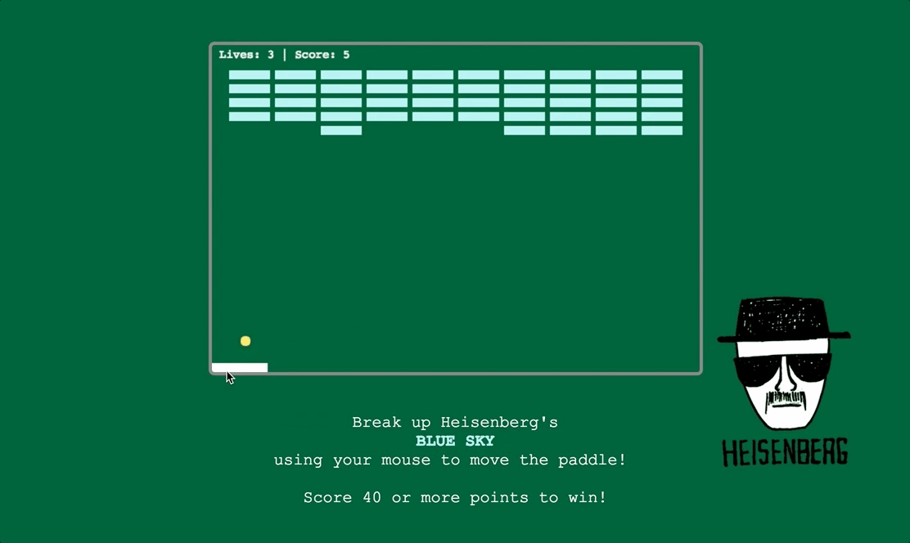

# Breaking Bricks



[Live link](https://hbkwong.github.io/Breaking-Bricks/)

Breaking Bricks is a pong-style game inspired by the arcade classic, Breakout. The game begins with several layers of bricks placed in the top portion of the screen. A ball travels across the screen, bouncing off these bricks as well as the top and side walls of the playing field.

As a brick is hit, the ball bounces away and the brick is destroyed. If the ball reaches the bottom of the screen, the player loses a turn. To prevent this, the player controls a moving paddle to bounce the ball, keeping it in play.

> Breaking Bricks is currently under development. If you have any recommendations or comments to share, please feel free to connect.

The game utilizes the following:

- JavaScript
- HTML5 Canvas

# Gameplay and Features

32 Blue Sky bricks line the playing field, each worth 1 point. When the player reaches 25 points, the player wins the game.

Current features of the game include:

- [X] A laterally-moving paddle keeps the game ball in play
- [X] Statistics (lives, score, etc.) are tracked and updated live on-screen
- [X] The game ball collides and bounces off other game objects
- [X] On-page instructions are viewable to guide the player

### Mouse-Based Controls

The player controls all movement of the paddle via mouse controls. Upon triggering a mouse event, the clientX property (read-only), will return the horizontal coordinate of the pointer.

After subtracting any offset pixels, if the resulting value is positive and within the horizontal plane, the paddle's position will be adjusted.

```javascript
handleMouseMove (e) {
  let distance = e.clientX - this.canvas.offsetLeft;

  if (0 < distance && this.canvas.width > distance) {
    this.paddle.x = distance - (0.5 * this.paddle.width);
  }
}
```

### Collision Detection

During gameplay, the ball collides with several other objects of the game:

- Paddle
- Brick
- Wall

With wall collisions, the angle of incidence (the collision) will equal the angle of reflection (the bounce).

For instance, we can look at the vertical component of the ball's trajectory. If the size of the ball is greater than its total change in vertical position, the ball reflects off the wall with an equal but opposite change in position.

```javascript
handleWallCollision () {
  let totalX = this.x + this.dx;
  let totalY = this.y + this.dy;

  if (totalX < this.radius || totalX > this.canvas.width - this.radius) {
    this.dx *= -1;
  } else if (totalY < this.radius) {
    this.dy *= -1;
  }
}
```

### Handling Broken Bricks

The game class manages much of the outcome when the ball collides with a brick. In checking for collisions, the game iterates through the bricks and checks for any currently unbroken. With the helper method #breakBrick, if a brick collision has indeed occurred:

1. The state of the brick is updated
2. The score increases by one
3. The ball continues its movement, albeit with an opposite vertical component

Once the score reaches a certain amount, the game is over.

```javascript
detectCollisions () {
  for (let idx = 0; idx < this.bricks.length; idx++) {
    for (let idx2 = 0; idx2 < this.bricks[idx].length; idx2++) {
      let brick = this.bricks[idx][idx2];
      if (brick.state === "unbroken") {
        this.breakBrick(brick);
      }
    }
  }
}

breakBrick (brick) {
  if (this.ball.checkBrickCollision(brick)) {
    brick.state = "broken";
    this.bricksHit += 1;
    this.ball.dy *= -1;
    if (this.bricksHit === 25) {
      this.result = "W";
      this.gameEnded = true;
    }
  }
}
```

### Future Release
* [ ] Pause and Resume
* [ ] Keyboard Controls
